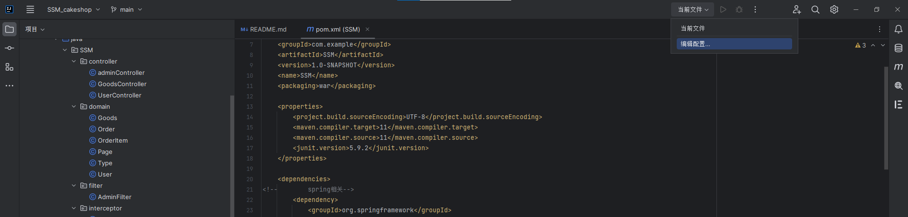
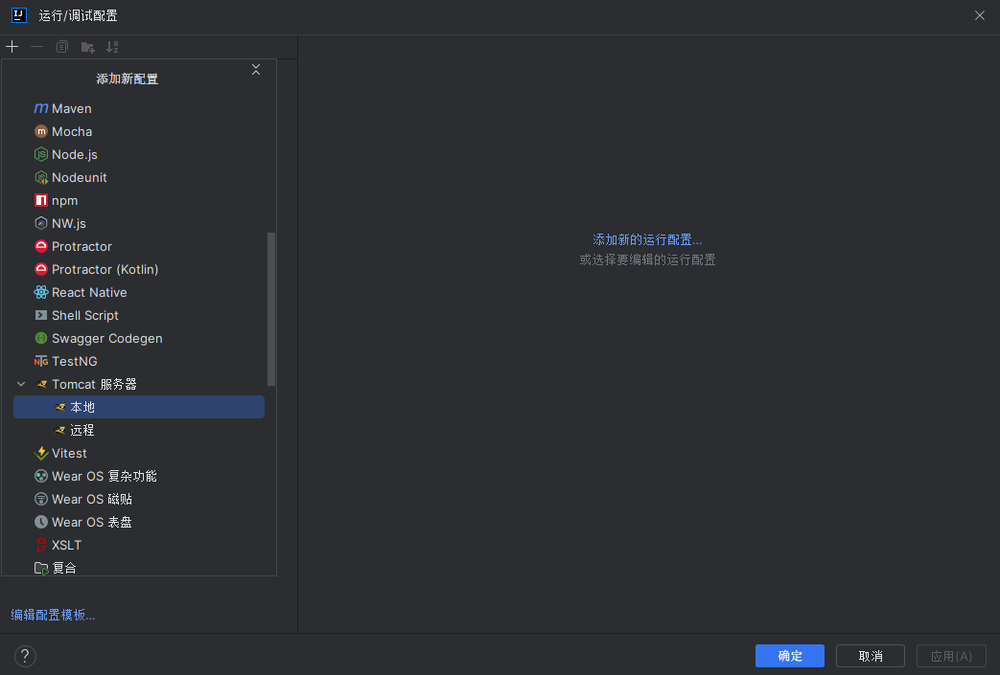
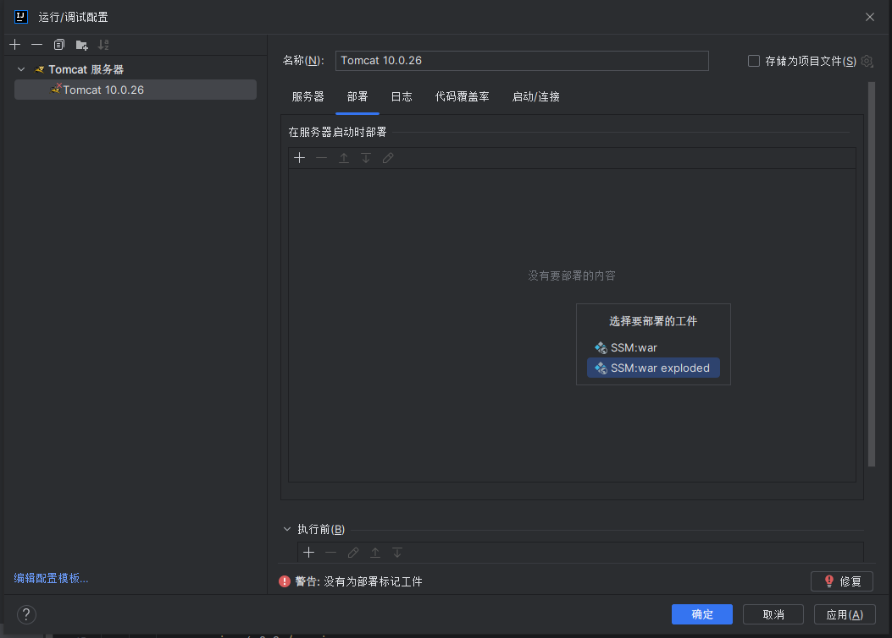
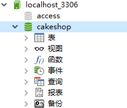
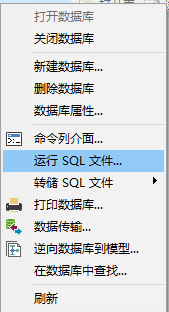
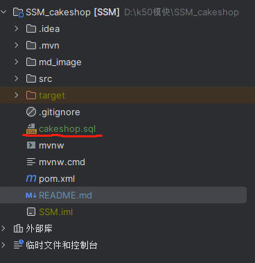
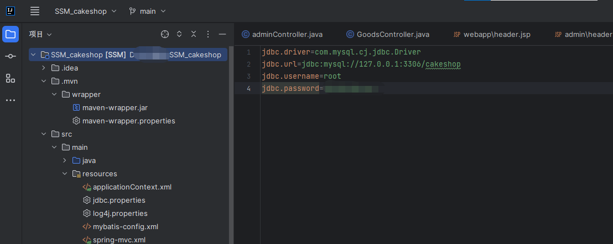

# 蛋糕商城
> 一个蛋糕商城购买网站！
>
> spring+springmvc+mybatis + JSP 开发的全栈项目，包含网站前台 + 管理员后台的完整前后端代码。
# 项目背景
为了入门spring和mybatis所做的简易网站

## 功能

- 首页
    - 登录注册
    - 个人中心
    - 后台管理
    - 搜索
    - 分类
    - 购物车
    - 订单管理
## 技术栈
### 前端

- JSP
- JavaScript

### 后端

- 主语言：java
- 开发框架：spring，springmvc，mybatis
- 数据库：mysql

### 部署

- web 服务器：tomcat10版本及以上

## 快速上手
### 环境要求：JDK,tomcat10

#### 配置tomcat本地服务器：
#### 编辑配置后添加tomcat本地服务器(版本10+)

#### 点击修复 选择SSM:war exploded

### 数据库
#### 在连接中新建一个名为cakeshop的数据库

#### 右键选择运行sql文件：选择本项目中的cakeshop.sql文件

#### 更改为自己的数据库用户和密码(resources 文件下的jdbc.properties)

### 运行
#### 运行tomcat即可

